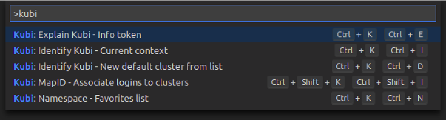
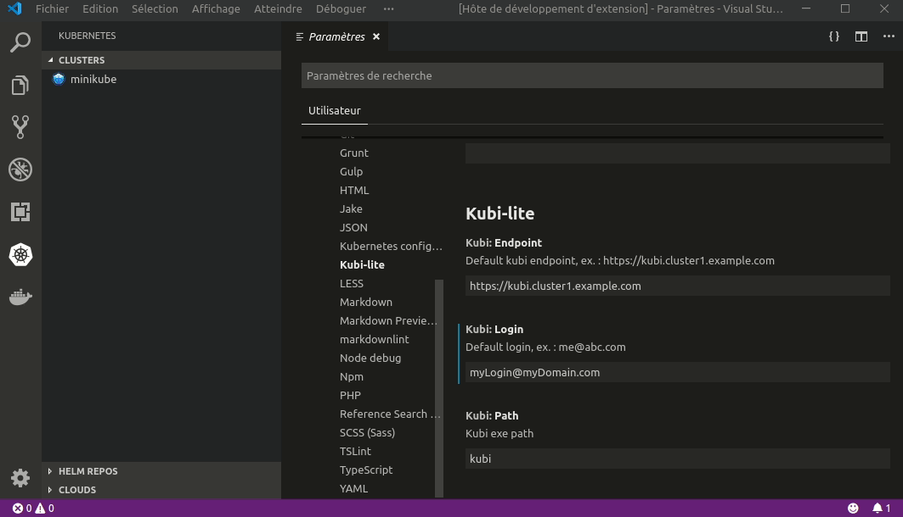
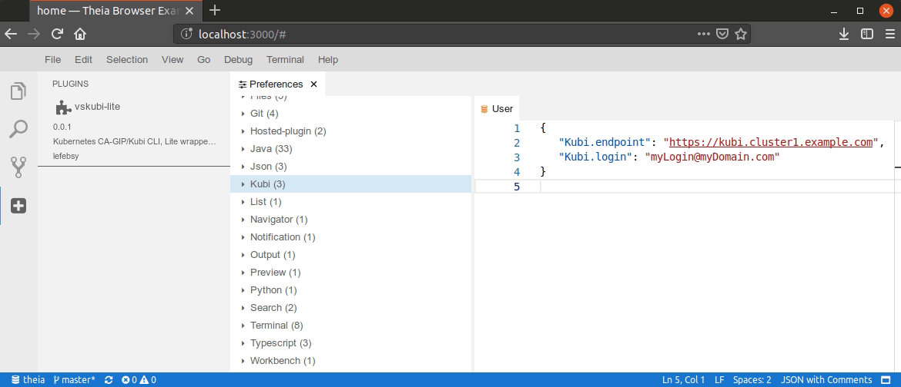

# __VSCode__ Kubi-Lite extension compatible with __Theia IDE__

__Kubi CLI__ is provided by CA-GIP at <https://github.com/ca-gip/kubi>.
This extension is a GUI wrapper compatible vith __VSCode__ and __Theia IDE__.

## Release notes

New features and modifications are available here : [CHANGELOG](CHANGELOG.md)

## Getting started

1. Download __Kubi CLI__ and add it to your path, or set the absolute path in the __Kubi-lite__ settings
2. Set preferences in VSCode settings
3. Use `ctrl+k ctrl+i` to invoke generation of the __KubeConfig__ in your `$HOME`.

## Main features

- __Kubi Explain__ : Detailed information about token `[ctrl k + ctrl e]` - *(need Kubi >= v1.8.3)*
- __Kubi Config__ : Authenticate :
  - Identify on current cluster `[ctrl k + ctrl i]`
  - Identify and set new default cluster `[ctrl k + ctrl d]`
- __Multiple Config__ : Manage many clusters `[ctrl Shift k + ctrl Shift i]` - *(better with Kubi >= v1.8.3)*
  - Multi clusters and logins support 
  - Advanced mode to map many logins on same cluster

- __Extend Microsoft Kubernetes explorer__ :
  - Display resources : *S3Bucket, VaultSecret, NetworkPolicy, ServiceMonitor, ResourceQuota, HorizontalPodAutoscaler, PodDisruptionBudget*
  - Right click menu on each cluster on sidePanel list to get a new token
- __Favorites namespaces__
  - Use favorites namespaces ! `[ctrl k + ctrl n]`
    - Partial matches are available. `"sys,pub"` will return sorted expanded list `["kube-public","kube-system"]`.
    - Kubernetes extension 'explorer view' is refreshed :-) 
- __Log/Debug__ : Kubi commands and errors are logged on dedicated kubi channel

  

## Visual settings & integration with Kubernetes extension

- Integration with : <https://github.com/Azure/vscode-kubernetes-tools>
- The command is added on the contextuals menus hover the "clusters view"

## Theia IDE

- On recent Theia instance, you can install Kubi-Lite directly from OpenVSX registry
- For older Theia instance, you can follow the manual installation instructions below :
  1. From VSCode marketplace or GitHub release, download the package extension `.vsix` to your Theia `Plugins repository`
  2. Set your keyBinding
  3. That's all ;-)
  

## License

- The code is licensed under the [MIT license](http://choosealicense.com/licenses/mit/). See [LICENSE](LICENSE).
- Logo is CA-GIP/Kubi logo : <https://github.com/ca-gip/kubi>
